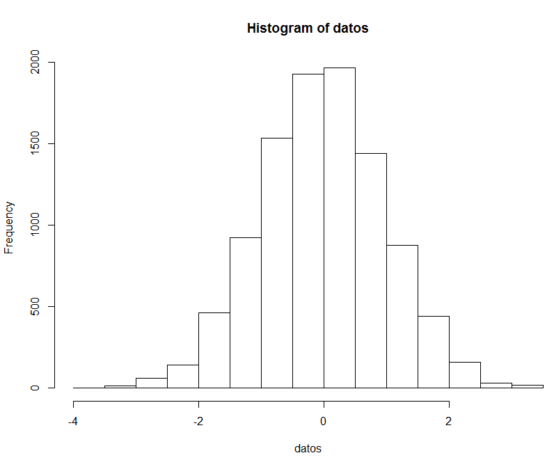

# Prácticas de R y RStudio
- Ejercicio: **Gráficas**
- Autor: **Juan Antonio García Cuevas**
- Fecha: 07/06/2016

#### Generar 10000 números aleatorios con una distribución normal estándar (media 0 y varianza 1). 
```
	datos <- rnorm(10000)
	head(datos, 5)
```
```
	[1] -1.107828 -1.252975  0.989110 -1.092775 -1.012457
```

#### Realizar un histograma de los valores anteriores. ¿Cual es el menor y mayor valor generado?. 
```
	hist(datos)
```
	
```
	valmin <- min(datos)
	valmin
```
```
	[1] -3.742496
```
	
```
	valmax <- max(datos)
	valmax
```
```
	[1] 3.416182
```

#### Generar los valores de la distribución normal teóricos en el intervalo anterior utilizando la función dnorm(). 

```
	datosrango <- seq(valmin, valmax, 0.05)
	head(datosrango, 5)
```
```
	[1] -3.742496 -3.692496 -3.642496 -3.592496 -3.542496
```
	
```
	datosnorm <- dnorm(datosrango)
	head(datosnorm, 5)
```
```
	[1] 0.0003626489 0.0004367277 0.0005246255 0.0006286404 0.0007513971
```
	
#### Al histograma anterior, superponer una curva con la función de densidad teórica calculada. ¿Se aproxima el histograma al valor teórico? 
```
	lines(datosrango, datosnorm)
```

La curva con la función de densidad teórica calculada no aparece en la gráfica. El motivo es que el eje Y del histograma representa frecuencia, y sus valores son demasiado altos (de 0 a 2.000) respecto a los valores que se representan en la curva de densidad teórica calculada (de 0 a 0,4).

#### Ver el parámetro probability de la función hist y volver a generar el histograma cambiando su valor. ¿Se aproxima ahora a la función de densidad teórica?.

Añadiendo el parámetro _probability=T_ o el parámetro _freq=F_, el eje Y pasa a mostrar valores de densidad, de modo que la curva de densidad teórica es ahora visible.

```
	hist(datos, probability=T)
	lines(datosrango, datosnorm)
```
	

